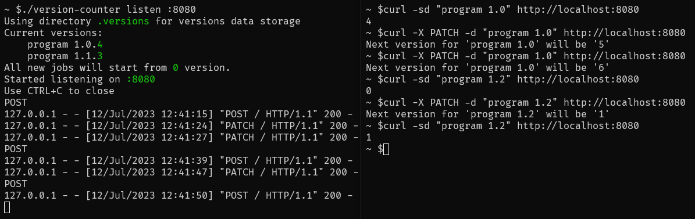

**`version-counter-py`**

- [About](#about)
- [Requirements](#requirements)
- [Usage](#usage)
- [Examples](#examples)
  * [CLI mode](#cli-mode)
  * [WebAPI mode](#webapi-mode)
  * [Jenkins](#jenkins)
    + [Installation](#installation)
    + [Pipeline example: patch version generation](#pipeline-example-patch-version-gen)

# About


Simple 3KB python script that maintains correct version number which can be useful for jenkins builds.

Script remembers current version for given **prefix**. **Prefix** could be anything but for jenkins purposes it could be something like 

- `PREFIX = $JOB_NAME + $MAJOR_VERSION` - to get minor version for job
- `PREFIX = $JOB_NAME + $MAJOR_MINOR_VERSION` - to get patch version for job
- etc.

It can be called directly by running script from shell or remotely with curl by running it as WebApi service.

# Requirements

Linux`*` with Python 3.9+`**`

`*` - should work also on windows without problems but I've not tested that.

`**` - may work on older Python 3 versions but I've not tested that.

# Usage

`./version-counter get "Program 1.0"` - gets version for prefix `Program 1.0`

`./version-counter bump "Program 1.0"` - bumps version for prefix `Program 1.0` 

`./version-counter show` - shows all currently maintained versions

`./version-counter listen :8080` - starts WebAPI which can be used with curl like:

```bash
curl -sd "Program 1.0" localhost:8080 # returns same result as `get "Program 1.0"`
curl -X PATCH -d "Program 1.0" localhost:8080 # returns same result as `bump "Program 1.0"`
```

`./version-counter -h` - shows basic help

`./version-counter listen -h` - shows basic help for listen mode

Default `.versions` directory location could be set by providing `--versions-dir`. 

# Examples

## CLI mode


## WebAPI mode




## Jenkins

### Installation

Simply copy `version-counter` to `JENKINS_HOME` and make it executable by running:

```
cp version-counter jenkins_home/.
cd jenkins_home && chmod o+x version-counter
```

Then `version-counter` could be called as `sh '~/version-counter get "$PREFIX"'` pipeline step. Version data will be automatically stored in `JENKINS_HOME/.versions` folder.

### Pipeline example: patch version generation<a id="pipeline-example-patch-version-gen"></a>

Full jenkins file used in following example is available <a href="examples/jenkinsfile">here</a>.

| Job number | Major minor version | Program output (_used as patch version_) | Version combined
|---|---|---|---|
| #1 (Success) | 1.0 | `0` | 1.0.`0`
| #2 (Success) | 1.0 | `1` | 1.0.`1`
| #3 (Failure) | 1.0 | `1` | 1.0.`1`
| #4 (Failure) | 1.0 | `1` | 1.0.`1`
| #5 (Success) | 1.0 | `2` | 1.0.`2`
| #6 (Success) | 1.0 | `3` | 1.0.`3`
| #7 (Success) | 1.1 | `0` | 1.1.`0`
| #8 (Success) | 1.1 | `1` | 1.1.`1`
| #9 (Success) | 1.0 | `4` | 1.0.`4`
| #10 (Success) | 0.1 | `0` | 0.1.`0`

In linked <a href="examples/jenkinsfile">jenkinsfile</a> patch version is bumped only for success builds - `version-counter bump` is called in `post { success { ... } }` block. That could be modifed by putting `version-counter bump` in different post block.

**Explanation:**

*Major minor version* - manually set from environment variable or user input. In jenkinsfile its named `MAJOR_MINOR_VERSION`

*Program output* - result of `version-counter get "JOB_NAME MAJOR_MINOR_VERSION"`

*Version combined* - combines version prefix with output from `version-counter`. In jenkins file its the line with `env.VERSION = env.MAJOR_MINOR_VERSION + '.' + env.PATCH_VERSION`
