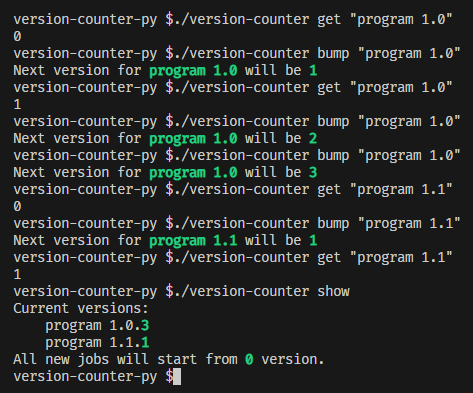

**`version-counter-py`**

- [About](#about)
  * [CLI mode](#cli-mode)
  * [API mode](#api-mode)
- [Usage](#usage)
  * [CLI](#cli)
  * [API](#api)
  * [Adding to jenkins](#adding-to-jenkins)
    + [Example of usage](#example-of-usage)
  * [Change `.versions` directory:](#versions-dir-change)

# About

Simple 3KB python script that maintains correct patch number useful for jenkins builds.

It remembers last patch number for given prefix - which could be anything but for jenkins purposes it could be something like `$JOB_NAME + $VERSION_PREFIX`.

It can be called by simply running script from cli or by running `listen` mode which starts api service that can be called with curl.


## CLI mode



## API mode


# Usage

Tested on linux.

Download latest `version-counter` and make it executable by `chmod u+x version-counter`

Now for checking all available arguments run:

- `./version-counter -h` to get general help

- `./version-counter cli -h` to get help about cli mode

- `./version-counter listen -h` to get help about api mode

## CLI

Getting version number

```
./version-counter cli "folder/job-name 1.0"
```

Bumping version number

```
./version-counter cli -u "folder/job-name 1.0"
```

## API

Starting server:

```
./version-counter listen :8080
```

Getting version number:

```
curl -sd "folder/job-name 1.0" localhost:8080
```

Bumping version number:

```
curl -X PATCH -d "folder/job-name 1.0" localhost:8080
```

## Adding to jenkins

Simply copy `version-counter` to `JENKINS_HOME` and make it executable. Version details will be automatically stored in `.versions` folder.

Ex:

```
cp version-counter jenkins_home/.
cd jenkins_home && chmod o+x version-counter
```

<a href="./examples/jenkinsfile">Example jenkins job</a>

### Example of usage

Full jenkins file used in following example is available <a href="examples/jenkinsfile">here</a>.

| Job number | Version prefix | Program output | Version combined
|---|---|---|---|
| #1 (Success) | 1.0 | `0` | 1.0.`0`
| #2 (Success) | 1.0 | `1` | 1.0.`1`
| #3 (Failure) | 1.0 | `1` | 1.0.`1`
| #4 (Failure) | 1.0 | `1` | 1.0.`1`
| #5 (Success) | 1.0 | `2` | 1.0.`2`
| #6 (Success) | 1.0 | `3` | 1.0.`3`
| #7 (Success) | 1.1 | `0` | 1.1.`0`
| #8 (Success) | 1.1 | `1` | 1.1.`1`
| #9 (Success) | 1.0 | `4` | 1.0.`4`
| #10 (Success) | 0.1 | `0` | 0.1.`0`

In upper example version is bumped only in success builds - *version counter with `-u` flag* is called only in `post { success { ... } }` block. It could be changed by putting *version counter wth `-u` flag* in different post segment.

Legend:

`Version prefix` - manually set from environment variable or user input. In jenkinsfile its named `VERSION_PREFIX`

*Version combined* - combines version prefix with output from `version-counter`. In jenkins file its the line with `env.VERSION = env.VERSION_PREFIX + '.' + env.VERSION_COUNTER`

## Change `.versions` directory:<a id="versions-dir-change"></a>

Specify `--versions-dir X` argument like:

`./version-counter --versions-dir .data cli "job_with_number_readed_from_.data_dir"`
